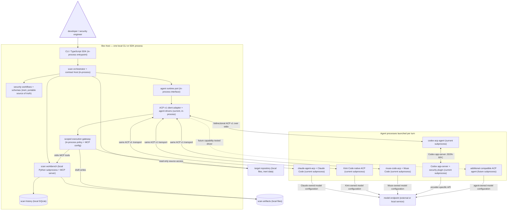

# Bex Security

**Open security workflows for every coding agent and model.**

[](https://github.com/openai/codex-security)
[](https://www.npmjs.com/package/@bex-co/bex-security)
[](https://github.com/agentclientprotocol)
[](LICENSE)

Bex Security is an upstream-first fork of
[OpenAI Codex Security](https://github.com/openai/codex-security). It keeps the
proven workflow for finding, validating, and fixing vulnerabilities while
working toward an open agent layer based on the
[Agent Client Protocol (ACP)](https://github.com/agentclientprotocol/agent-client-protocol).

Our north star is simple: run a consistent, evidence-driven security workflow
with the agent and model that fit your repository, without falling behind
upstream security improvements.

> ⭐ If you want security tooling that is portable across agents, editors, and
> models, star this repository and watch the roadmap.

## Quick start

Requires Node.js 22.13.0 or later in the 22.x release line, Node.js 24.x or
Node.js 26.x, and Python 3.10 or later.

```bash
npm install --global @bex-co/bex-security
bex-security scan /path/to/repository --agent claude
```

Or run directly without a global installation:

```bash
npx @bex-co/bex-security scan /path/to/repository --agent claude
```

The published npm package already contains the generated security plugin; the
additional build steps below apply only to a source checkout.

To work from source, clone the repository, install both dependency trees, and
build the bundled plugin and CLI:

```bash
git clone https://github.com/bex-co/bex-security.git
cd bex-security
pnpm --dir sdk/typescript install --frozen-lockfile
npm ci --prefix plugins/codex-security/mcp-app --no-audit --no-fund
pnpm --dir sdk/typescript run build:plugin
pnpm --dir sdk/typescript run build
./bex-security scan /path/to/repository --agent claude
```

Run `./bex-security` from the checkout, or add the checkout to `PATH` for the
current shell if you prefer the bare command:

```bash
export PATH="$PWD:$PATH"
bex-security --help
```

## Why Bex Security

- **Upstream-first, not a rewrite.** Bex uses a repeatable upstream `main`
  merge workflow and treats Codex Security compatibility as a product
  requirement.
- **Agent-open by design.** ACP standardizes communication between code editors
  and coding agents. Bex uses that boundary to support a growing ecosystem
  without building a bespoke integration for every client.
- **Model choice today.** The inherited CLI already supports OpenAI,
  OpenRouter, Fireworks, and Amazon Bedrock provider paths.
- **Security outcomes over raw output.** The workflow carries findings from
  discovery through validation, remediation, comparison, and publication.

## Project status

Bex Security is an early-stage fork published as `@bex-co/bex-security`. It
preserves the upstream CLI behavior and `codex-security` command alias while
making `bex-security` the primary command. Its first ACP vertical slice runs
Codex sessions through `codex-acp`, and its pluggable agent integrations run
Claude Code through `claude-agent-acp` and Kimi Code through its native `kimi
acp` server.
Muse Code runs through Bex's community `muse-code-acp` adapter.

| Capability                                       | Status               |
| ------------------------------------------------ | -------------------- |
| Codex Security-compatible CLI and TypeScript SDK | Available            |
| Multiple inference-provider paths                | Available            |
| Repeatable upstream merge workflow               | Available            |
| Codex sessions over ACP v1 and `codex-acp`       | Alpha                |
| Claude Code sessions over `claude-agent-acp`     | Alpha                |
| Kimi Code sessions over native `kimi acp`        | Alpha                |
| Muse Code sessions over `muse-code-acp`          | Alpha                |
| Kimi models through Claude Code                  | Alpha                |
| Additional ACP agents                            | Contributors welcome |
| Bex-branded CLI (`bex-security`)                 | Available            |
| Bex-branded npm package                          | Available            |

### Target architecture

ACP is an agent-runtime boundary, not a replacement for Bex's security
orchestration or a universal model API. Bex must continue to own scan scope,
workflow selection, permissions, artifact validation, persistence, and final
sealing regardless of which agent executes the work.



The adapter makes Bex the ACP client and selects a small agent driver for
`codex-acp`, `claude-agent-acp`, native `kimi acp`, or `muse-code-acp`. Bex
launches the selected agent per turn, negotiates ACP v1, creates or resumes its session, streams
protocol updates into the existing scan observers, forwards cancellation, and
preserves the current noninteractive permission boundary. The agent still owns
model authentication and access; Bex continues to own scan scope, the workflow,
workbench tools, and artifact validation. This keeps the integration small
enough to track upstream while proving that orchestration is independent of one
agent transport.

The adapter boundary is capability-based rather than Codex-shaped. A new agent
must prove that it can run the same scoped workflow and produce artifacts that
pass Bex's existing validation and sealing contract. ACP does not make agents
or model APIs interchangeable by itself.

To make the workflow portable, Bex must extract the security instructions and
schemas from Codex-specific plugin loading into a runtime-neutral workflow pack.
Agent-produced files remain drafts until the Bex workbench validates and seals
them. [`codex-acp`](https://github.com/agentclientprotocol/codex-acp) is a useful
first compatibility target and reference implementation, not a required layer
for every agent.

## Roadmap

1. **Stay current:** continuously merge upstream changes and keep the existing
   CLI, SDK, security controls, and scan artifacts compatible.
2. **Extract the stable host contract:** separate portable prompts, schemas,
   workbench tools, artifact rules, and progress events from Codex plugin
   installation details.
3. **Harden the ACP v1 vertical slice:** expand the Codex and Claude drivers
   from protocol and compatibility tests to repeatable full-scan fixtures,
   structured-output conformance, and interruption tests.
4. **Open the agent port:** add registry agents only when they pass the same
   capability, artifact-contract, and scan-integrity suite.
5. **Expand by evidence:** publish a capability-based compatibility matrix for
   agents and the models they expose. Keep draft ACP v2 support experimental
   until the protocol stabilizes.
6. **Release independently:** publish Bex builds as
   `upstreamVersion-bex.N`, with package metadata recording the exact upstream
   baseline.

Want to help? High-leverage contributions include ACP protocol mapping,
official-schema contract fixtures, agent/model compatibility reports, upstream
regression automation, and concise onboarding examples. Tell us which
[ACP agent](https://github.com/agentclientprotocol/registry) you want Bex to
support first.

## Upstream compatibility

Bex publishes the TypeScript SDK and CLI as `@bex-co/bex-security`. The
`bex-security` command is primary, while `codex-security` remains a compatible
alias for existing scripts. Bex releases use `upstreamVersion-bex.N` and record
their upstream package version and commit in npm metadata. See the [upstream
Codex Security documentation](https://learn.chatgpt.com/docs/security/cli) for
the complete CLI reference and
[upstream releases](https://github.com/openai/codex-security/releases) for the
canonical changelog and upgrade notes.

The wrapper forwards every argument to the Bex CLI. The TypeScript package also
exposes `bex-security` as a bin alias while retaining `codex-security` for
upstream compatibility.

Some cybersecurity requests and protected findings require approval through
Trusted Access for Cyber. To join the program, visit
[chatgpt.com/cyber](https://chatgpt.com/cyber).

## Choose an agent

To scan with Claude Code, authenticate Claude locally and select the Claude ACP
agent:

```bash
./bex-security scan /path/to/repository --agent claude
```

To run Claude Code with GLM through Z.AI, provide a Z.AI API key and select the
Z.AI provider:

```bash
export ZAI_API_KEY="<your-zai-api-key>"
./bex-security scan /path/to/repository --agent claude --provider zai
```

This defaults to `glm-5.3[1m]`. Select another GLM model explicitly when
needed:

```bash
./bex-security scan . --agent claude --provider zai --model glm-5.3
```

Bex configures Z.AI only for the Claude ACP subprocess. It does not rewrite
your Claude Code settings or store the API key. See the
[Z.AI Claude Code guide](https://docs.z.ai/devpack/tool/claude) for account and
model availability details.

Kimi is available either as a model provider behind Claude Code or as a native
ACP agent. The Claude provider path uses a Kimi API key and defaults to
`kimi-for-coding`:

```bash
export KIMI_API_KEY="<your-kimi-api-key>"
./bex-security scan . --agent claude --provider kimi
./bex-security scan . --agent claude --provider kimi --model k3-256k
```

For the native path, install Kimi Code, make sure `kimi` is on `PATH`, and log
in once before scanning:

```bash
kimi login
./bex-security scan . --agent kimi
./bex-security scan . --agent kimi --model kimi-code/k3-256k --effort high
```

The native agent uses Kimi Code's saved authentication and provider settings.
Bex starts `kimi acp`, forwards its security workbench over ACP, and reports the
model and thinking level negotiated by Kimi. See the
[Kimi Code installation guide](https://www.kimi.com/code/docs/en/kimi-code-cli/guides/getting-started.html),
[Kimi ACP reference](https://www.kimi.com/code/docs/en/kimi-code-cli/reference/kimi-acp),
and [Kimi Claude Code guide](https://www.kimi.com/code/docs/en/third-party-tools/claude-code.html).

Muse Code is available through the Bex-maintained
[`@bex-co/muse-code-acp`](https://github.com/bex-co/muse-code-acp) adapter.
The adapter ships with Bex Security; install Muse Code and authenticate it once:

```bash
muse login
```

Then select Muse for a scan:

```bash
./bex-security scan . --agent muse
./bex-security scan . --agent muse --model muse-spark-1.2-contributor --effort high
```

Bex forwards its stdio security workbench through ACP. Muse owns model
authentication and configuration. Muse does not expose additional ACP
workspace roots or interactive tool approvals, and usage or cost may be
unavailable when a scan completes. Because Muse does not expose delegated
workers through ACP, Bex automatically runs bounded host-managed review
assignments and advances file coverage only for completed, non-truncated read
operations. The existing scan command needs no Muse-specific orchestration
flag.

Codex remains the default agent. Sign in with ChatGPT or provide an API key:

```bash
./bex-security login
./bex-security scan /path/to/repository
```

Common scan commands:

```bash
./bex-security scan . --patch
./bex-security scan . --patch --patch-severity high --json
./bex-security scan . --patch --patch-severity high --create-pr
./bex-security scan . --model gpt-5.6-terra --effort high
./bex-security scan . --agent claude
./bex-security scan . --agent claude --provider zai --model glm-5.3
./bex-security scan . --agent claude --provider kimi
./bex-security scan . --agent kimi
./bex-security scan . --agent muse
./bex-security scan . --scan-prompt-file scan.md --post-scan-prompt-file follow-up.md
./bex-security scan . --validation-prompt-file validation.md
./bex-security scan . --mode deep --workers 2 --subagents 0 --stop-after-no-new 3 --max-discovery-runs 10 --max-time-hours 1.5
```

For CI with Codex, set `OPENAI_API_KEY` or `CODEX_API_KEY` instead of signing
in. `--agent claude` delegates authentication and model discovery to the local
Claude Code installation unless a provider is selected. `--agent kimi`
delegates both to the local Kimi Code installation, and `--agent muse`
delegates both to Muse Code through `muse-code-acp`. The default remains
`--agent codex`; saved scan
recipes created before agent selection also replay with Codex.

Use `--validation-prompt-file` to replace final validation with your own setup,
testing, and cleanup instructions. This works for standard and diff scans;
Deep scans do not support it. See [custom validation](sdk/typescript/README.md#custom-validation).
For a runnable local example, see the [custom validation demo](examples/custom-validation/README.md).
Environment API keys are passed directly to the current scan and are never
stored in Codex's credential home or system keyring.

After showing the findings summary, interactive scans with findings ask whether
to open a finding browser where you can inspect full details, choose a severity
threshold, select individual findings, and add patch instructions for each one.
Each selected finding runs in its own saved Codex desktop task.
Use `--patch --patch-severity high` to fix high and critical findings. Add
`--create-pr`, or enable the pull request option during review, to commit the
verified files and open a draft GitHub pull request. Ordinary scans do not
change repository files.

Deep-scan discovery stops after 96 hours by default. Set `--max-time-hours` to
any positive number of hours, including fractional hours, up to 96. Completed
findings are preserved and returned when the limit is reached.

For a monorepo, run separate standard scans and combine their results by root
cause:

```bash
./bex-security scan-components . \
  --component apps/api --component apps/web \
  --output-dir /path/outside/repository/results
```

Use `--auto` to let Codex choose the components, or `--auto --plan-only` to
review the split first. See [component scans](sdk/typescript/README.md#scan-project-components)
for reusable plans, combined reports, and coverage details.

To use another inference provider, set its API key and select a model:

```bash
export OPENROUTER_API_KEY="<your-openrouter-api-key>"
./bex-security scan . --agent codex --provider openrouter --model anthropic/claude-sonnet-4.5

export FIREWORKS_API_KEY="<your-fireworks-api-key>"
./bex-security scan . --agent codex --provider fireworks --model accounts/fireworks/models/qwen3-235b-a22b

export AWS_BEARER_TOKEN_BEDROCK="<your-bedrock-api-key>"
export AWS_REGION="us-east-2"
./bex-security scan . --agent codex --provider amazon-bedrock --model openai.gpt-5.6-luna
```

Amazon Bedrock also supports standard AWS access keys, profiles, web identity,
container credentials, and the default AWS credential chain.

Local sign-in honors Codex's configured credential backend, including a system
keyring required by a managed device. Bex Security keeps login and scan
credentials in the same private, persistent state directory.

If both a ChatGPT sign-in and an API key are available, interactive scans ask
which credential to use. CI and other noninteractive scans keep the existing
API-key precedence. Select a credential explicitly when needed:

```bash
./bex-security scan . --auth chatgpt
./bex-security scan . --auth api-key
```

To make your ChatGPT sign-in the automatic default, unset any configured API
keys:

```bash
unset OPENAI_API_KEY CODEX_API_KEY
```

Scan history is stored in the Bex Security workbench state directory. If that
directory cannot be written, set `CODEX_SECURITY_STATE_DIR` to a writable
directory outside the repository.

Applications can attribute API-key scans to an end user with
`scan --safety-identifier ID` or the SDK's per-run `safetyIdentifier` option.
See [Safety ID setup and runtime requirements](sdk/typescript/README.md#attribute-scans-to-end-users).

`findings list [repository]` shows open findings across a repository's scans
and identifies findings not confirmed in its latest scan.

Use `patch OCCURRENCE_ID` to fix one saved finding, or
`patch --scan SCAN_ID --severity high` to fix selected findings from a saved
scan. Add `--json` for structured results or `--create-pr` to open a draft
GitHub pull request after verification. If publication fails, use the printed
`patch --resume-pr BRANCH` command to retry without running Codex again.

Use `patch --linear-issue SEC-123` to import and fix a Linear issue, or
`patch --linear-project "Security backlog" --linear-filter '{"labels":{"name":{"eq":"security"}}}'`
to fix matching open issues from a project. Set
`CODEX_SECURITY_LINEAR_API_KEY` to authorize read-only Linear access.

`scans compare BEFORE_SCAN_ID AFTER_SCAN_ID` automatically matches findings by
root cause, reuses saved matches, and identifies new, persisting, reopened,
resolved, or unknown findings. Missing findings remain unknown when coverage is
incomplete or their original location was not reviewed.

## Publish scan findings

Publish every finding from a completed scan to a Linear team:

```bash
./bex-security publish scan /path/to/scan \
  --to linear \
  --linear-team TEAM_ID
```

Add `--linear-project PROJECT_ID` to place the issues in a Linear project, or
omit it to create issues directly in the team. The existing `--project` flag
remains an alias. Omit the scan directory to select a
completed scan interactively. You can also set `CODEX_SECURITY_LINEAR_TEAM` and
the optional `CODEX_SECURITY_LINEAR_PROJECT` instead of passing the destination
flags. Add `--dry-run` to preview the issues or `--json` to return
machine-readable results.

By default, publishing uses your existing Codex sign-in and connected Linear
app without a separate Linear token. To publish directly through the Linear API
instead, set `CODEX_SECURITY_LINEAR_API_KEY` to a Linear personal API key.
Direct publication leaves issues unassigned by default; pass
`--linear-assignee EMAIL_OR_USER_ID` to select a Linear user:

```bash
export CODEX_SECURITY_LINEAR_API_KEY=YOUR_LINEAR_PERSONAL_API_KEY
./bex-security publish scan /path/to/scan \
  --to linear \
  --linear-team TEAM_ID \
  --linear-project PROJECT_ID \
  --linear-assignee teammate@example.com
```

Use `--linear-assignee USER_ID` to select a Linear user ID instead of an email
address, or omit the flag to leave the issues unassigned.

`--linear-api-key KEY` also selects direct publication and takes precedence
over the environment variable. Prefer the environment variable to keep API keys
out of shell history and process listings. Every finding creates a new issue
containing the scan ID, affected code locations, source snippets, and
remediation guidance. Choose a destination authorized to receive the
repository's source code and vulnerability details.

## Verbose diagnostics

Add `--verbose` to print scan diagnostics to stderr:

```bash
./bex-security scan . --verbose
```

`CODEX_SECURITY_LOG_LEVEL=debug` also enables diagnostics;
`LOG_LEVEL=debug` is its fallback. JSON results remain on stdout.

Verbose diagnostics may contain sensitive data. Review local logs before
sharing them. Saved failure summaries, bulk-scan receipts, and the normal
activity feed omit messages that contain recognizable credentials.

Use `./bex-security scans logs SCAN_ID` to inspect saved session
events from a scan and its workers. Press `d` during a scan to inspect
unredacted details; `a`, `m`, and `1`–`9` select all, main, or worker
sessions. These events can contain credentials.

## TypeScript SDK

Codex Security is a Javascript package:

```ts
import { CodexSecurity } from "@bex-co/bex-security";

const security = new CodexSecurity();
const result = await security.run("/path/to/directory");
await security.run("/path/to/directory", {
  mode: "deep",
  workers: 2,
  subagents: 0,
  stopAfterNoNew: 3,
  maxDiscoveryRuns: 10,
  maxTimeHours: 1.5,
});

console.log(result.reportPath);
await security.close();
```

## Containerized bulk scans

Use the upstream image and included Docker Compose configuration for
noninteractive, resumable scans of repositories pinned to immutable Git
revisions. See the [container quick start](sdk/typescript/README.md#containerized-bulk-scans)
for authentication, private result storage, and optional Ubuntu AppArmor
hardening.

Pass `--knowledge-base PATH` to share security documents with every repository;
repeat the option for multiple files or directories.

Use `--scan-prompt-file PATH` to add shared scan instructions, and add a `prompt`
CSV column for repository-specific instructions. Use
`--post-scan-prompt-file PATH` to run a follow-up after each scan, including
incomplete or failed scans.

For individual CLI stages with durable state and access to a separately deployed
findings service, use the same scanner image with the
[workflow runner Compose example](docker/README.md#workflow-runner).

## Findings service (preview)

Run `bex-security serve` to start the service without Docker. See
[running without Docker](sdk/typescript/README.md#running-without-docker)
for prerequisites, credentials, and storage configuration.

The [findings service](sdk/typescript/README.md#findings-service-preview) runs
from the same `ghcr.io/openai/codex-security` image as the scanner (or a local
source build), with a separate container and state volume configured by
`compose.findings.yaml`. It stores findings and embeddings in SQLite and lists
findings with pagination. Its read-only dashboard at `/dashboard` refreshes every
five seconds and shows stored findings and duplicate groups from the service's
database. It also returns potential duplicates by embedding similarity within a
repository or an explicit all-repository scope. The
`bex-security publish scan --to custom --findings-url http://localhost:3000`
command uploads completed findings and their repository ID. The SDK and
`bex-security dedupe` command retrieve candidates, run independent reviews
locally, and persist accepted duplicate groups; `--all-repositories`
opts into the broader scope.

## Other providers

For complete command help, runtime defaults, native multi-agent worker limits,
environment variables, deep-scan configuration, and SDK options, see the
[package README](sdk/typescript/README.md) and the
[upstream CLI reference](https://learn.chatgpt.com/docs/security/cli/reference).
