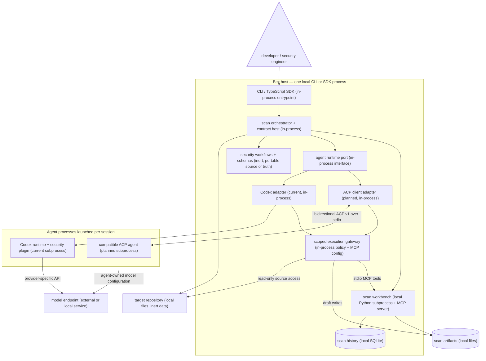

# Bex Security

**Open security workflows for every coding agent and model.**

[](https://github.com/openai/codex-security)
[](https://github.com/agentclientprotocol)
[](LICENSE)

Bex Security is an upstream-first fork of
[OpenAI Codex Security](https://github.com/openai/codex-security). It keeps the
proven workflow for finding, validating, and fixing vulnerabilities while
working toward an open agent layer based on the
[Agent Client Protocol (ACP)](https://github.com/agentclientprotocol/agent-client-protocol).

Our north star is simple: run a consistent, evidence-driven security workflow
with the agent and model that fit your repository, without falling behind
upstream security improvements.

> ⭐ If you want security tooling that is portable across agents, editors, and
> models, star this repository and watch the roadmap.

## Why Bex Security

- **Upstream-first, not a rewrite.** Bex uses a repeatable upstream `main`
  merge workflow and treats Codex Security compatibility as a product
  requirement.
- **Agent-open by design.** ACP standardizes communication between code editors
  and coding agents. Bex will use that boundary to support a growing ecosystem
  without building a bespoke integration for every client.
- **Model choice today.** The inherited CLI already supports OpenAI,
  OpenRouter, Fireworks, and Amazon Bedrock provider paths.
- **Security outcomes over raw output.** The workflow carries findings from
  discovery through validation, remediation, comparison, and publication.

## Project status

Bex Security is an early-stage fork. The current codebase preserves the
upstream package name and CLI behavior so existing workflows keep working. ACP
support is the direction of travel, not a shipped feature yet.

| Capability                                       | Status                            |
| ------------------------------------------------ | --------------------------------- |
| Codex Security-compatible CLI and TypeScript SDK | Available                         |
| Multiple inference-provider paths                | Available                         |
| Repeatable upstream merge workflow               | Available                         |
| ACP agent integration                            | Planned — contributors welcome    |
| Bex-branded package and binary                   | Planned with a compatibility path |

### Target architecture

ACP is an agent-runtime boundary, not a replacement for Bex's security
orchestration or a universal model API. Bex must continue to own scan scope,
workflow selection, permissions, artifact validation, persistence, and final
sealing regardless of which agent executes the work.



The current Codex adapter remains the compatibility baseline. The planned ACP
adapter makes Bex the client: it launches an agent, negotiates capabilities,
opens sessions, sends prompts, streams updates, handles cancellation and
permission requests, and supplies scoped filesystem, terminal, and stdio MCP
access. The selected agent—not ACP or Bex—owns its model/provider connection and
may expose model and reasoning choices through ACP session configuration.

To make the workflow portable, Bex must extract the security instructions and
schemas from Codex-specific plugin loading into a runtime-neutral workflow pack.
Agent-produced files remain drafts until the Bex workbench validates and seals
them. [`codex-acp`](https://github.com/agentclientprotocol/codex-acp) is a useful
first compatibility target and reference implementation, not a required layer
for every agent.

## Roadmap

1. **Stay current:** continuously merge upstream changes and keep the existing
   CLI, SDK, security controls, and scan artifacts compatible.
2. **Extract the stable host contract:** separate portable prompts, schemas,
   workbench tools, artifact rules, and progress events from Codex plugin
   installation details.
3. **Add the ACP v1 adapter:** use the official TypeScript SDK for capability
   negotiation, authentication, sessions, cancellation, permissions, scoped
   filesystem/terminal access, and stdio MCP tools.
4. **Prove the vertical slice:** run the full scan lifecycle through
   `codex-acp`, then add registry agents only when they pass the same contract
   and scan-integrity tests.
5. **Expand by evidence:** publish a capability-based compatibility matrix for
   agents and the models they expose. Keep draft ACP v2 support experimental
   until the protocol stabilizes.
6. **Graduate the brand:** introduce Bex package and binary names with a clear
   migration path for existing `@openai/codex-security` users.

Want to help? High-leverage contributions include ACP protocol mapping,
official-schema contract fixtures, agent/model compatibility reports, upstream
regression automation, and concise onboarding examples. Tell us which
[ACP agent](https://github.com/agentclientprotocol/registry) you want Bex to
support first.

## Upstream compatibility

Until Bex publishes its own package, installation and command examples use the
upstream `@openai/codex-security` name. See the
[upstream Codex Security documentation](https://learn.chatgpt.com/docs/security/cli)
for the complete CLI reference and
[upstream releases](https://github.com/openai/codex-security/releases) for the
canonical changelog and upgrade notes.

Some cybersecurity requests and protected findings require approval through
Trusted Access for Cyber. To apply or check your access, visit
[chatgpt.com/cyber](https://chatgpt.com/cyber).

## Quick start

Requires Node.js 22.13.0 or later in the 22.x release line, Node.js 24.x, or
Node.js 26.x; Python 3.10 or later; and access required by the upstream Codex
Security runtime.

```bash
npm install @openai/codex-security
npx @openai/codex-security login
npx @openai/codex-security scan .
npx @openai/codex-security scan . --patch
npx @openai/codex-security scan . --patch --patch-severity high --json
npx @openai/codex-security scan . --patch --patch-severity high --create-pr
npx @openai/codex-security scan . --model gpt-5.6-terra --effort high
npx @openai/codex-security scan . --scan-prompt-file scan.md --post-scan-prompt-file follow-up.md
npx @openai/codex-security scan . --validation-prompt-file validation.md
npx @openai/codex-security scan . --mode deep --workers 2 --subagents 0 --stop-after-no-new 3 --max-discovery-runs 10 --max-time-hours 1.5
```

For CI, set `OPENAI_API_KEY` or `CODEX_API_KEY` instead of signing in.

Use `--validation-prompt-file` to replace final validation with your own setup,
testing, and cleanup instructions. This works for standard and diff scans;
Deep scans do not support it. See [custom validation](sdk/typescript/README.md#custom-validation).
For a runnable local example, see the [custom validation demo](examples/custom-validation/README.md).
Environment API keys are passed directly to the current scan and are never
stored in Codex's credential home or system keyring.

After showing the findings summary, interactive scans with findings ask whether
to open a finding browser where you can inspect full details, choose a severity
threshold, select individual findings, and add patch instructions for each one.
Each selected finding runs in its own saved Codex desktop task.
Use `--patch --patch-severity high` to fix high and critical findings. Add
`--create-pr`, or enable the pull request option during review, to commit the
verified files and open a draft GitHub pull request. Ordinary scans do not
change repository files.

Deep-scan discovery stops after 96 hours by default. Set `--max-time-hours` to
any positive number of hours, including fractional hours, up to 96. Completed
findings are preserved and returned when the limit is reached.

For a monorepo, run separate standard scans and combine their results by root
cause:

```bash
npx @openai/codex-security scan-components . \
  --component apps/api --component apps/web \
  --output-dir /path/outside/repository/results
```

Use `--auto` to let Codex choose the components, or `--auto --plan-only` to
review the split first. See [component scans](sdk/typescript/README.md#scan-project-components)
for reusable plans, combined reports, and coverage details.

To use another inference provider, set its API key and select a model:

```bash
export OPENROUTER_API_KEY="<your-openrouter-api-key>"
npx @openai/codex-security scan . --provider openrouter --model anthropic/claude-sonnet-4.5

export FIREWORKS_API_KEY="<your-fireworks-api-key>"
npx @openai/codex-security scan . --provider fireworks --model accounts/fireworks/models/qwen3-235b-a22b

export AWS_BEARER_TOKEN_BEDROCK="<your-bedrock-api-key>"
export AWS_REGION="us-east-2"
npx @openai/codex-security scan . --provider amazon-bedrock --model openai.gpt-5.6-luna
```

Amazon Bedrock also supports standard AWS access keys, profiles, web identity,
container credentials, and the default AWS credential chain.

Local sign-in honors Codex's configured credential backend, including a system
keyring required by a managed device. Bex Security keeps login and scan
credentials in the same private, persistent state directory.

If both a ChatGPT sign-in and an API key are available, interactive scans ask
which credential to use. CI and other noninteractive scans keep the existing
API-key precedence. Select a credential explicitly when needed:

```bash
npx @openai/codex-security scan . --auth chatgpt
npx @openai/codex-security scan . --auth api-key
```

To make your ChatGPT sign-in the automatic default, unset any configured API
keys:

```bash
unset OPENAI_API_KEY CODEX_API_KEY
```

Scan history is stored in the Bex Security workbench state directory. If that
directory cannot be written, set `CODEX_SECURITY_STATE_DIR` to a writable
directory outside the repository.

Applications can attribute API-key scans to an end user with
`scan --safety-identifier ID` or the SDK's per-run `safetyIdentifier` option.
See [Safety ID setup and runtime requirements](sdk/typescript/README.md#attribute-scans-to-end-users).

`findings list [repository]` shows open findings across a repository's scans
and identifies findings not confirmed in its latest scan.

Use `patch OCCURRENCE_ID` to fix one saved finding, or
`patch --scan SCAN_ID --severity high` to fix selected findings from a saved
scan. Add `--json` for structured results or `--create-pr` to open a draft
GitHub pull request after verification. If publication fails, use the printed
`patch --resume-pr BRANCH` command to retry without running Codex again.

Use `patch --linear-issue SEC-123` to import and fix a Linear issue, or
`patch --linear-project "Security backlog" --linear-filter '{"labels":{"name":{"eq":"security"}}}'`
to fix matching open issues from a project. Set
`CODEX_SECURITY_LINEAR_API_KEY` to authorize read-only Linear access.

`scans compare BEFORE_SCAN_ID AFTER_SCAN_ID` automatically matches findings by
root cause, reuses saved matches, and identifies new, persisting, reopened,
resolved, or unknown findings. Missing findings remain unknown when coverage is
incomplete or their original location was not reviewed.

## Publish scan findings

Publish every finding from a completed scan to a Linear team:

```bash
npx @openai/codex-security publish scan /path/to/scan \
  --to linear \
  --linear-team TEAM_ID
```

Add `--linear-project PROJECT_ID` to place the issues in a Linear project, or
omit it to create issues directly in the team. The existing `--project` flag
remains an alias. Omit the scan directory to select a
completed scan interactively. You can also set `CODEX_SECURITY_LINEAR_TEAM` and
the optional `CODEX_SECURITY_LINEAR_PROJECT` instead of passing the destination
flags. Add `--dry-run` to preview the issues or `--json` to return
machine-readable results.

By default, publishing uses your existing Codex sign-in and connected Linear
app without a separate Linear token. To publish directly through the Linear API
instead, set `CODEX_SECURITY_LINEAR_API_KEY` to a Linear personal API key.
Direct publication leaves issues unassigned by default; pass
`--linear-assignee EMAIL_OR_USER_ID` to select a Linear user:

```bash
export CODEX_SECURITY_LINEAR_API_KEY=YOUR_LINEAR_PERSONAL_API_KEY
npx @openai/codex-security publish scan /path/to/scan \
  --to linear \
  --linear-team TEAM_ID \
  --linear-project PROJECT_ID \
  --linear-assignee teammate@example.com
```

Use `--linear-assignee USER_ID` to select a Linear user ID instead of an email
address, or omit the flag to leave the issues unassigned.

`--linear-api-key KEY` also selects direct publication and takes precedence
over the environment variable. Prefer the environment variable to keep API keys
out of shell history and process listings. Every finding creates a new issue
containing the scan ID, affected code locations, source snippets, and
remediation guidance. Choose a destination authorized to receive the
repository's source code and vulnerability details.

## Verbose diagnostics

Add `--verbose` to print scan diagnostics to stderr:

```bash
npx @openai/codex-security scan . --verbose
```

`CODEX_SECURITY_LOG_LEVEL=debug` also enables diagnostics;
`LOG_LEVEL=debug` is its fallback. JSON results remain on stdout.

Verbose diagnostics may contain sensitive data. Review local logs before
sharing them. Saved failure summaries, bulk-scan receipts, and the normal
activity feed omit messages that contain recognizable credentials.

Use `npx @openai/codex-security scans logs SCAN_ID` to inspect saved session
events from a scan and its workers. Press `d` during a scan to inspect
unredacted details; `a`, `m`, and `1`–`9` select all, main, or worker
sessions. These events can contain credentials.

## TypeScript SDK

```ts
import { CodexSecurity } from "@openai/codex-security";

const security = new CodexSecurity();
const result = await security.run(".");
await security.run(".", {
  mode: "deep",
  workers: 2,
  subagents: 0,
  stopAfterNoNew: 3,
  maxDiscoveryRuns: 10,
  maxTimeHours: 1.5,
});

console.log(result.reportPath);
await security.close();
```

## Containerized bulk scans

Use the upstream image and included Docker Compose configuration for
noninteractive, resumable scans of repositories pinned to immutable Git
revisions. See the [container quick start](sdk/typescript/README.md#containerized-bulk-scans)
for authentication, private result storage, and optional Ubuntu AppArmor
hardening.

Pass `--knowledge-base PATH` to share security documents with every repository;
repeat the option for multiple files or directories.

Use `--scan-prompt-file PATH` to add shared scan instructions, and add a `prompt`
CSV column for repository-specific instructions. Use
`--post-scan-prompt-file PATH` to run a follow-up after each scan, including
incomplete or failed scans.

For complete command help, runtime defaults, native multi-agent worker limits,
environment variables, deep-scan configuration, and SDK options, see the
[package README](sdk/typescript/README.md) and the
[upstream CLI reference](https://learn.chatgpt.com/docs/security/cli/reference).
